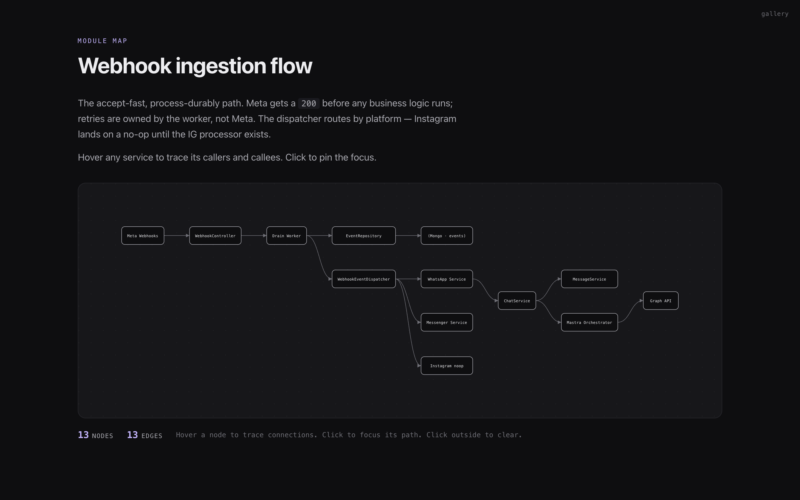

<h1 align="center">to-html</h1>

<p align="center">HTML rendering mode for Claude Code. Type <code>/to-html</code> and every substantive reply opens in your browser.</p>

<p align="center">
  <a href="https://ibrahemid.github.io/plugins/to-html/">Live gallery</a> ·
  <a href="#install">Install</a> ·
  <a href="#templates">Templates</a> ·
  <a href="#how-it-works">How it works</a> ·
  <a href="./CHANGELOG.md">Changelog</a>
</p>

<p align="center">
  <a href="https://ibrahemid.github.io/plugins/examples/to-html/diagram.html">
    
  </a>
</p>

## Install

```
/plugin marketplace add ibrahemid/plugins
/plugin install to-html@ibrahemid
```

## Use

```
/to-html       toggle mode (state persists per project)
/to-html diag  diagnostics if the hook seems silent
```

First enable asks once whether to auto-open. Answer persists.

## Templates

The Stop hook classifies each reply and picks one. Click any thumbnail to interact with the live artifact.

<table>
  <tr>
    <td align="center" width="33%">
      <a href="https://ibrahemid.github.io/plugins/examples/to-html/diagram.html">
        
      </a>
      <br><sub><b>diagram</b> — interactive module map, hover to trace, click to focus</sub>
    </td>
    <td align="center" width="33%">
      <a href="https://ibrahemid.github.io/plugins/examples/to-html/plan.html">
        
      </a>
      <br><sub><b>plan</b> — phase sidebar, live status, focus checkboxes</sub>
    </td>
    <td align="center" width="33%">
      <a href="https://ibrahemid.github.io/plugins/examples/to-html/comparison.html">
        
      </a>
      <br><sub><b>comparison</b> — side-by-side, pros/cons, pick + reason</sub>
    </td>
  </tr>
  <tr>
    <td align="center">
      <a href="https://ibrahemid.github.io/plugins/examples/to-html/explainer.html">
        
      </a>
      <br><sub><b>explainer</b> — TL;DR pill, sticky TOC, reading column</sub>
    </td>
    <td align="center">
      <a href="https://ibrahemid.github.io/plugins/examples/to-html/prose.html">
        
      </a>
      <br><sub><b>prose</b> — editorial typography, drop cap, roman-numeral sections</sub>
    </td>
    <td align="center" valign="middle">
      <sub><b>skip</b> — under 240 chars, no headings, no code: no artifact. Terminal stays clean.</sub>
    </td>
  </tr>
</table>

| Triggers on | Template |
|---|---|
| ` ```mermaid ` block (`graph TD/LR`) | `diagram` |
| `## Phase N:` headings or 3+ `[ ]` tasks | `plan` |
| 2+ `## Option / Approach / Variant` headings | `comparison` |
| `TL;DR:` keyword or multi-section structure | `explainer` |
| Anything else with structure | `prose` |
| Under 240 chars, no structure | `skip` |

Override the classifier from any reply by prepending a fenced block:

````
```to-html
{"template":"diagram","title":"Auth handshake"}
```
````

## How it works

A `Stop` hook reads the assistant's reply, runs a deterministic classifier (no LLM tokens spent), dispatches to the chosen template, and writes a self-contained HTML file outside your project. A second hook on `ExitPlanMode` always renders the plan as a live dashboard that auto-reloads as tasks progress.

The diagram template parses `mermaid graph TD/LR` syntax, computes a topological layout, and renders pure SVG with hover-highlight and click-to-focus interactivity. No mermaid runtime dependency — output is one self-contained HTML file.

```
~/Library/Caches/cc-to-html/artifacts/<session>/   (macOS)
~/.cache/cc-to-html/artifacts/<session>/           (Linux)
%LOCALAPPDATA%\cc-to-html\Cache\artifacts\         (Windows)
```

Decision-bar buttons (Copy as prompt) only emit what you selected in the artifact, never the full input.

## Diagnostics

If the hook seems silent after install:

```
/to-html diag
```

Prints current state, recent hook events, and tells you whether the hook is firing. Most common fix after install or update: `/reload-plugins`, or a full Claude Code restart.

## Security

- CSP: `default-src 'none'; style-src 'unsafe-inline'; img-src data:; script-src 'unsafe-inline'`. No network, no remote assets, no forms.
- Tag/attribute allowlist sanitizer. All `on*` handlers stripped.
- Link `href` / image `src` validated against `https:`, `http:`, `mailto:`, `#`, `/`, `data:image/*`.
- Claude never writes raw HTML. Markdown is parsed by vendored `marked@13.0.3` (MIT) and rendered through structured templates.

## Requirements

Node 18+. No npm install. 64 tests via `npm test`.

## License

MIT.
