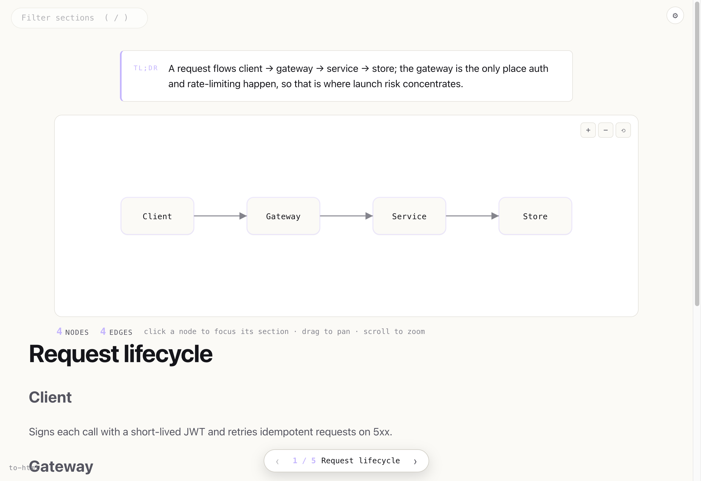

# to-html

Type `/to-html` and substantive Claude Code replies render to a self-contained HTML page: a TL;DR, an interactive concept map from `mermaid` blocks, and a body set for reading. Quiet by default; short or flat replies render nothing.

<p align="center">
  
</p>

## Install

```
/plugin marketplace add ibrahemid/plugins
/plugin install to-html@ibrahemid
```

Run `/reload-plugins` after install so the hooks register.

## Use

```
/to-html                       toggle on/off
/to-html config auto-open yes  open each artifact in the browser
/to-html config theme dark     theme · size · width · font
/to-html diag                  why nothing rendered
```

Live examples and the full template set:
[gallery](https://ibrahemid.github.io/plugins/to-html/) · [changelog](./CHANGELOG.md)

## Notes

Deterministic Node, no npm install, vendored `marked`. Claude never writes HTML. Strict CSP: no network, no remote assets, no forms. Node 18+, `npm test`.

MIT.
