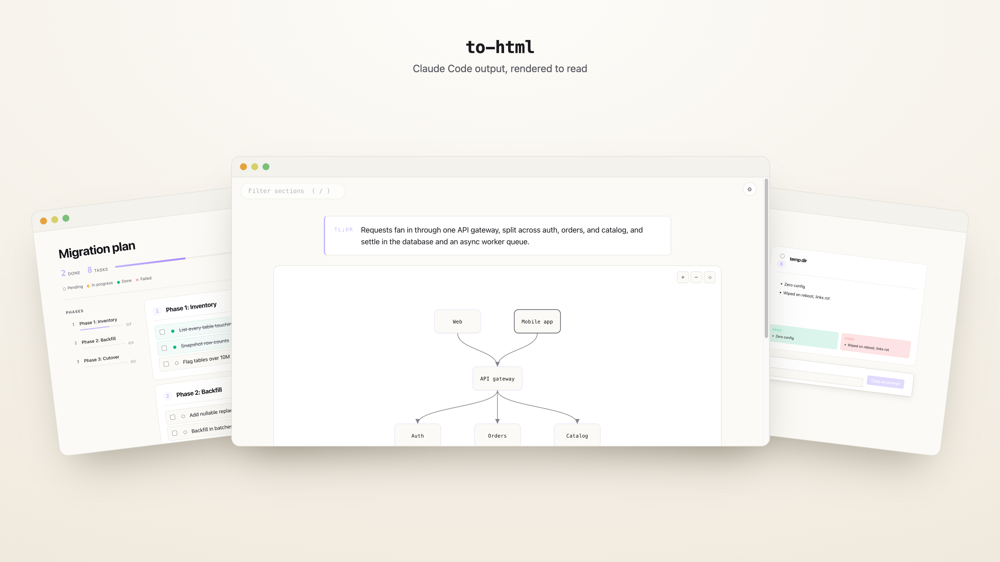
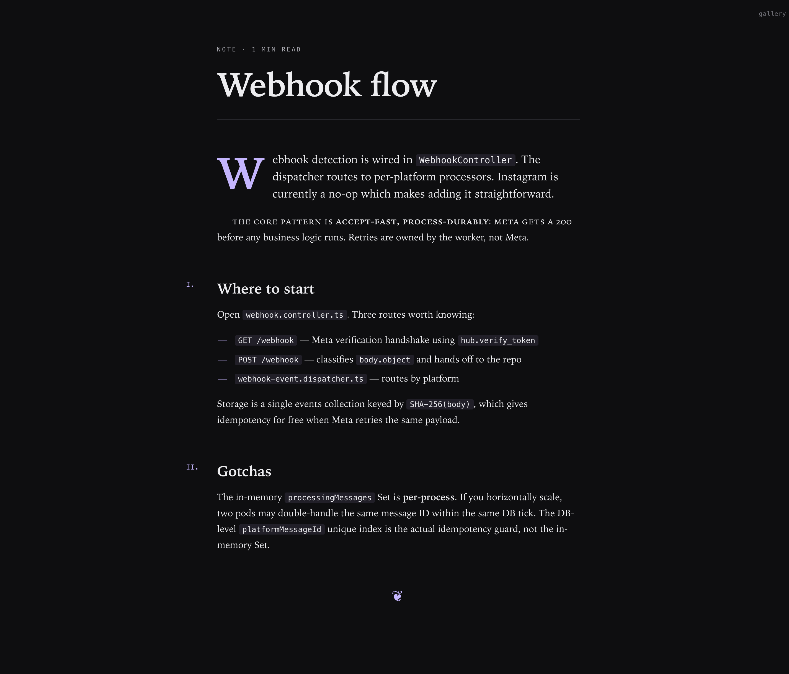
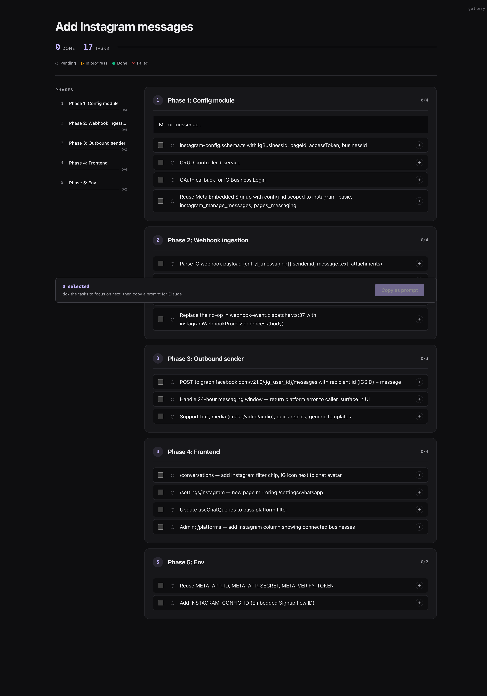
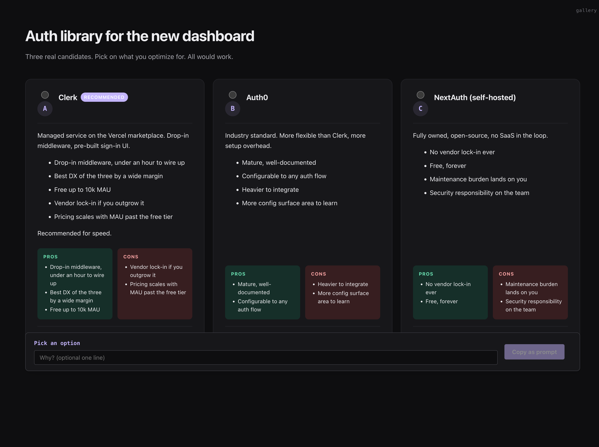
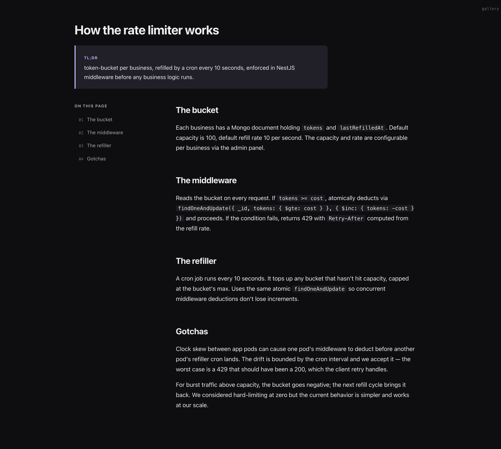

<h1 align="center">to-html</h1>

<p align="center">HTML rendering mode for Claude Code. Type <code>/to-html</code> and every substantive reply opens in your browser.</p>

<p align="center">
  <a href="https://ibrahemid.github.io/plugins/to-html/">Live gallery</a> ·
  <a href="#install">Install</a> ·
  <a href="./CHANGELOG.md">Changelog</a>
</p>

<p align="center">
  <picture>
    <source media="(prefers-color-scheme: dark)" srcset="./docs/screenshots/hero-dark.png">
    
  </picture>
</p>

## Install

```
/plugin marketplace add ibrahemid/plugins
/plugin install to-html@ibrahemid
```

## Use

```
/to-html       toggle mode (state persists per project)
/to-html diag  diagnostics if the hook seems silent
```

First enable asks once whether to auto-open. Answer persists.

## Templates

The Stop hook classifies each reply and picks one. Click any thumbnail for a live interactive example.

<table>
  <tr>
    <td align="center">
      <a href="https://ibrahemid.github.io/plugins/to-html/#prose"></a>
      <br><sub><b>prose</b> — editorial typography</sub>
    </td>
    <td align="center">
      <a href="https://ibrahemid.github.io/plugins/to-html/#plan"></a>
      <br><sub><b>plan</b> — phase sidebar, live status, focus checkboxes</sub>
    </td>
  </tr>
  <tr>
    <td align="center">
      <a href="https://ibrahemid.github.io/plugins/to-html/#comparison"></a>
      <br><sub><b>comparison</b> — side-by-side, pros/cons, pick + reason</sub>
    </td>
    <td align="center">
      <a href="https://ibrahemid.github.io/plugins/to-html/#explainer"></a>
      <br><sub><b>explainer</b> — TL;DR pill, sticky TOC</sub>
    </td>
  </tr>
</table>

Trivial replies (one-liners, status echoes) get no artifact.

## How it works

A Stop hook reads the assistant's reply, runs a classifier, dispatches to one of the templates above, and writes a self-contained HTML file outside your project. A second hook on `ExitPlanMode` always renders the plan as a live dashboard that auto-reloads as tasks progress.

The renderer is deterministic Node — Claude never writes raw HTML, so token cost is markdown-cost, not HTML-cost.

```
~/Library/Caches/cc-to-html/artifacts/<session>/   (macOS)
~/.cache/cc-to-html/artifacts/<session>/           (Linux)
%LOCALAPPDATA%\cc-to-html\Cache\artifacts\         (Windows)
```

## Override (optional)

Force a template by prepending a fenced block to a reply:

````
```to-html
{"template":"comparison","title":"Three approaches"}
```
````

## Requirements

Node 18+. No npm install. Tested on 64 cases via `npm test`.

## License

MIT
